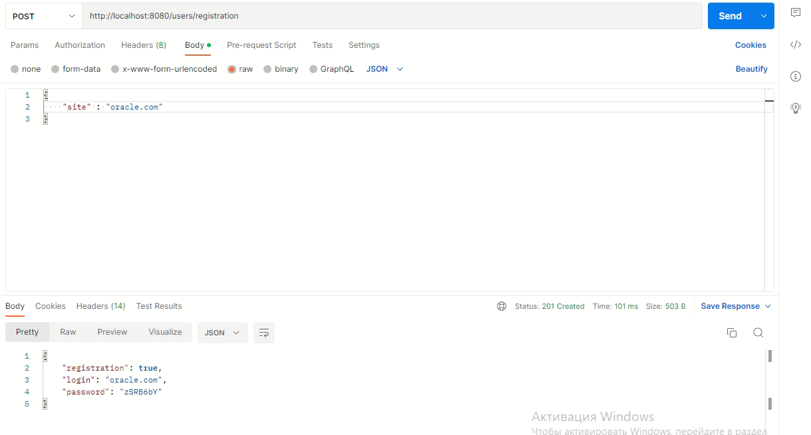
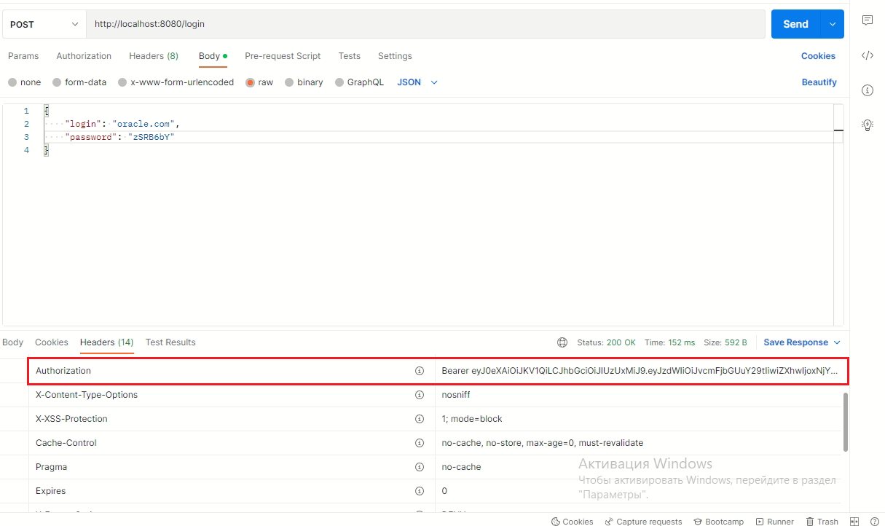
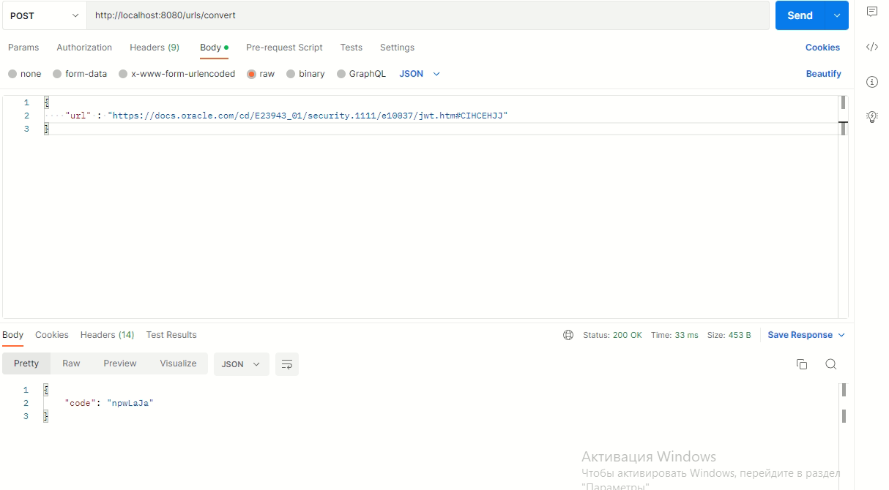
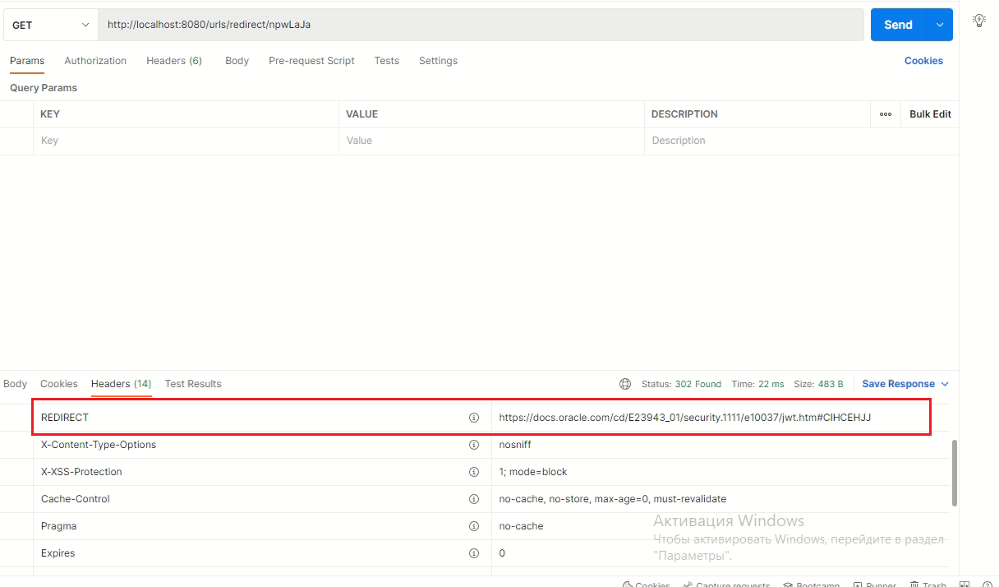
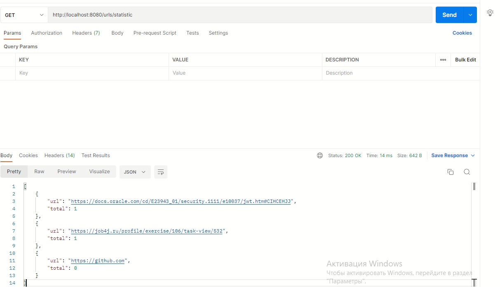

# url_shortcut

## Описание

Сервис предназначено для организации безопасности пользователей.
Каждый зарегистрированный на сервисе пользователь может добавить URL-адрес и получить короткую ссылку на него.
Все ссылки на сайте который работает с сервисом заменяются ссылками на сервис.

Проект реализован по принципу RestFull API архитектуры.

## Технологии

- Java 17
- PostgreSQL 14
- Hibernate 5.6.10.Final
- Spring Boot 2
- Spring Data JPA
- Spring Security
- JWT

## Требования к окружению

- Java 17
- Apache Maven 3.8.1
- PostgreSQL 14

## Запуск приложения

- Запустите утилиту pgAdmin 4
- Введите пароль
- В меню Object выберите пункт Create/Database и введите имя job4j_url_shortcut
- Клонируйте репозиторий с помощью утилиты CLI, введя команду

```shell
git clone https://github.com/Aleksandr-Molchanov/url_shortcut C:\projects\url_shortcut
```

- Перейдите в директорию C:\projects\url_shortcut\src\main\resources
- Откройте файл application.properties измените username и password на те, которые использовали
  и сохраните измененный файл.
- В утилите CLI перейдите в корень проекта, используя команду

```shell
cd C:\projects\url_shortcut
```

- Выполните сборку проекта с помощью команды

```shell
mvn install
```

- Запустите приложение командой

```shell
java -jar target/url_shortcut-0.0.1-SNAPSHOT.jar
```

## Функционал

Для использования сервиса, пользователю нужно зарегистрироваться по адресу http://localhost:8080/users/registration
В ответе он получит логин и пароль.
Флаг registration указывает, что регистрация выполнена или нет.


После того, как пользователь получил логин и пароль, он сможет авторизоваться на сервисе.
Авторизация сделана через JWT. Пользователь отправляет POST запрос с login и password и получает ключ.


И этот ключ далее отправляет в запросе в блоке HEAD при регистрации URL.
Чтобы зарегистрировать URL, авторизованный пользователь отправляет POST запрос c URL и получает короткую ссылку.


Когда пользователь отправляет ссылку с кодом в ответ возвращается ассоциированный адрес и статус 302.
Этот GET запрос выполняется без авторизации.


В сервисе считается количество вызовов каждого адреса.
По сайту можно получить статистку всех адресов и количество вызовов этого адреса.


## Контакты

email: [molchanov_a.v@mail.ru](molchanov_a.v@mail.ru)